# copy-file-name

### Copy File name/path to the clipboard via keybinding/explorer context/editor text context/editor title context

### File name only or with relative path copied.

### With/Without extension copied

## For keybinding(support both single file and multiple files)

- copy file name with extension (default ctrl(cmd)+alt+shift+Q)
  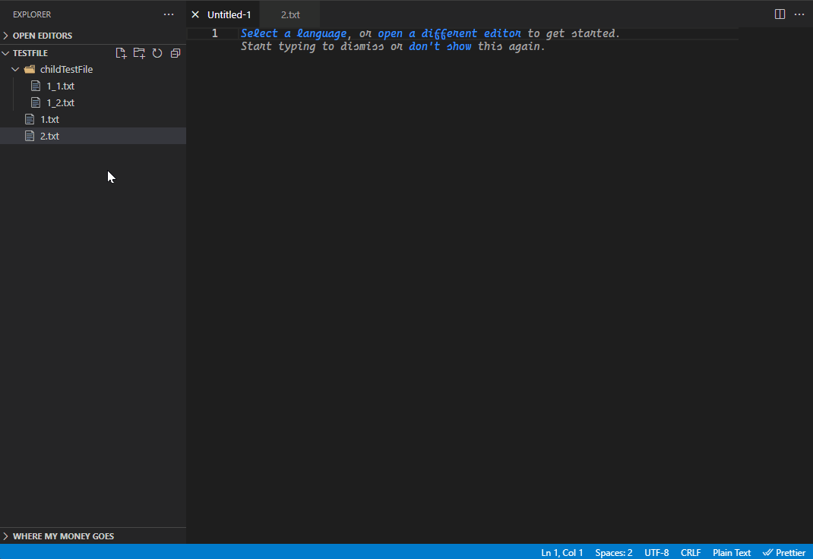
- copy file name without extension (default ctrl(cmd)+alt+shift+W)
  
- copy relative file path with extension (default ctrl(cmd)+alt+shift+E)
  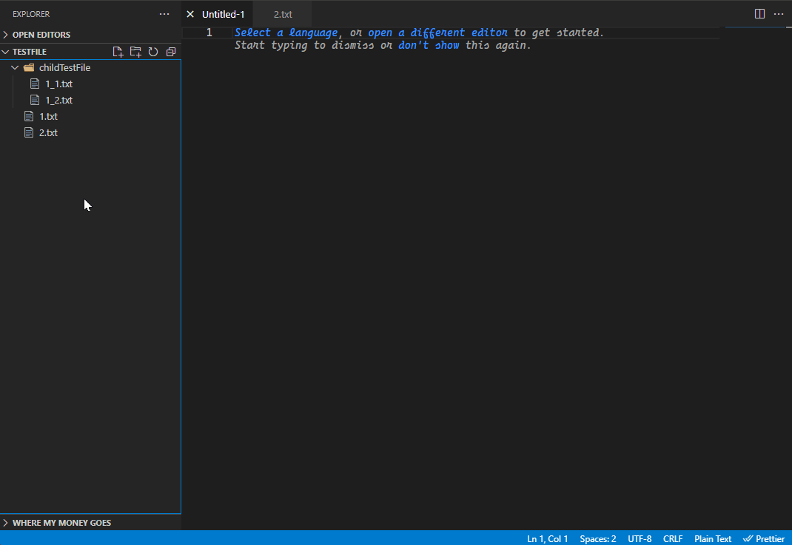
- copy relative file path without extension (default ctrl(cmd)+alt+shift+R)
  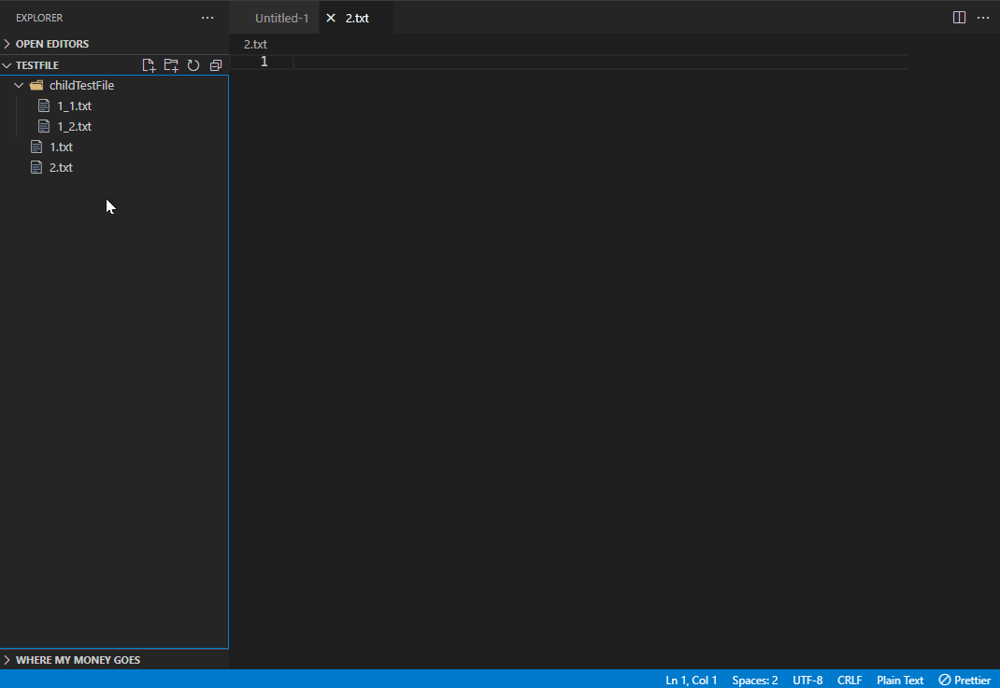

## For explorer context(support both single file and multiple files)

- copy file name with extension
  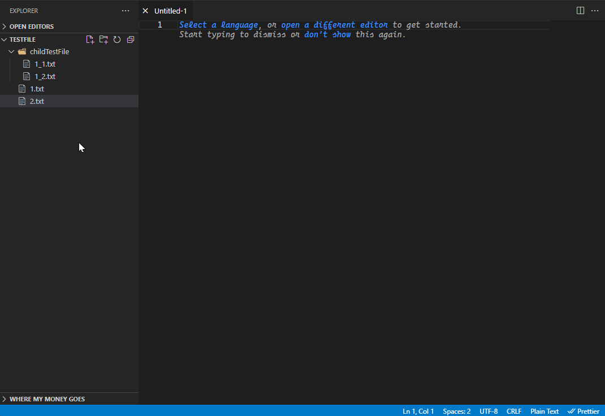
- copy file name without extension
  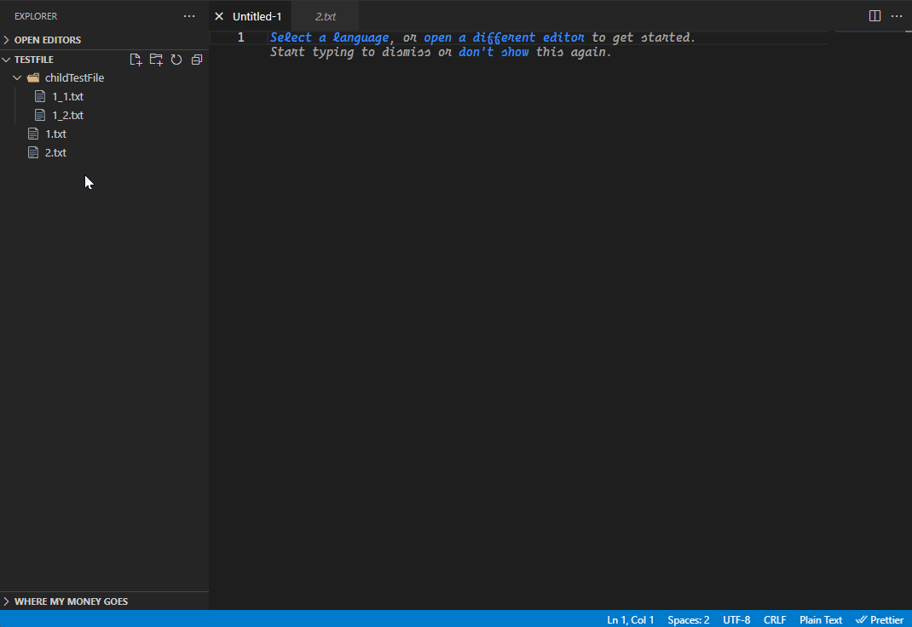
- copy relative file path with extension
  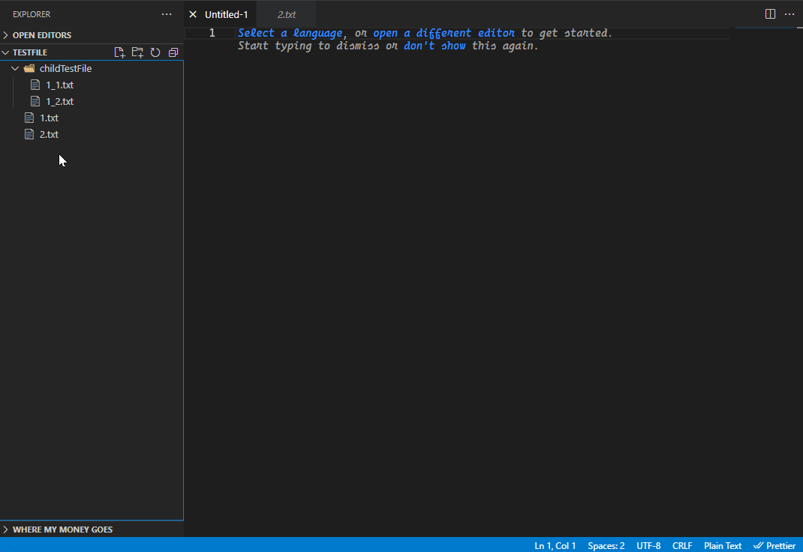
- copy relative file path without extension
  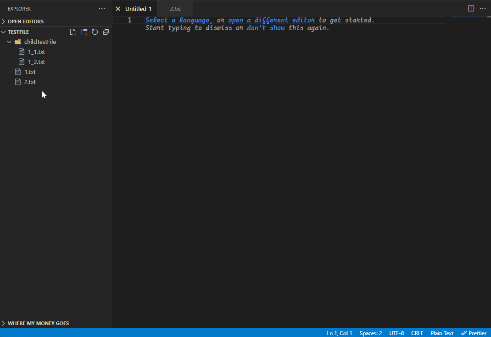

## For editor text context(only support single file)

- copy file name with extension
  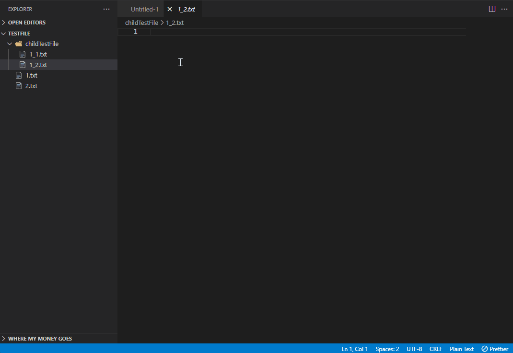
- copy file name without extension
  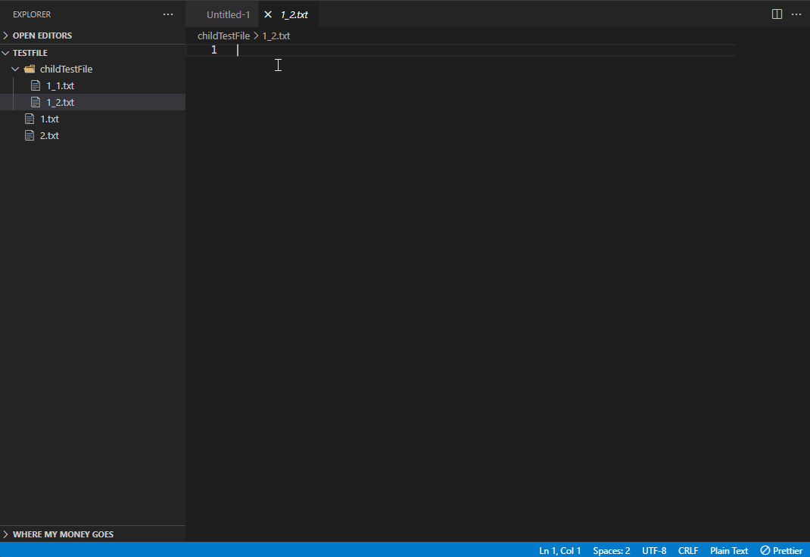
- copy relative file path with extension
  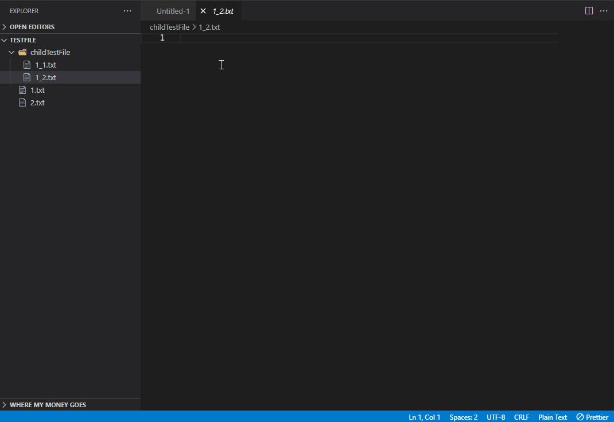
- copy relative file path without extension
  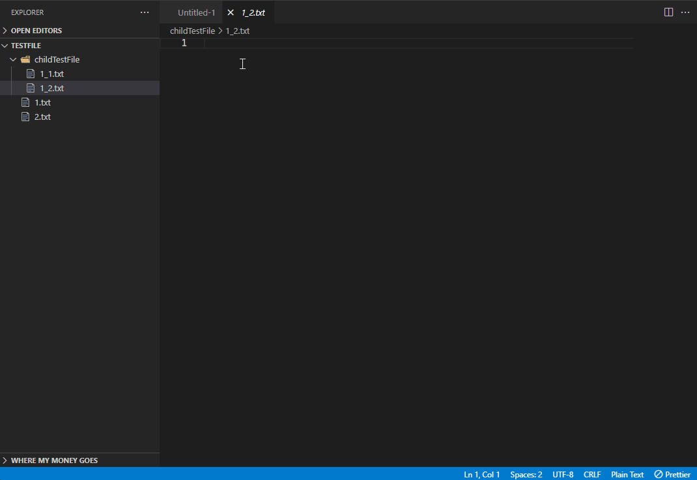

## For editor title context(only support single file)

- copy file name with extension
  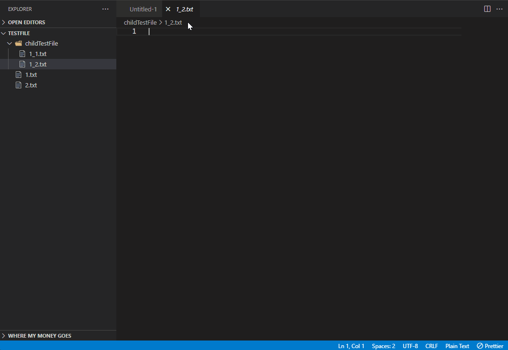
- copy file name without extension
  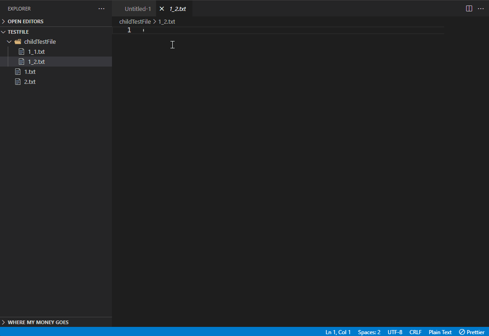
- copy relative file path with extension
  
- copy relative file path without extension
  
